# Testing
​
Return back to the [README.md](README.md) file.
​

The Primary Pigments website has met the objectives set by all parties involved. It's responsive on various screen sizes, ensuring clean and crisp images without excessive empty space. Users can easily navigate and contact us through the contact form or social media. The content is concise, and the design is uncluttered, providing a user-friendly experience.
​
## Code Validation
​
### HTML
​
I have used the recommended [HTML W3C Validator](https://validator.w3.org) to validate all of my HTML files.
​
The URL will look something like this:
​
- https://validator.w3.org/nu/?doc=https%3A%2F%2Fprimarypigments.github.io%2FPrimary.Pigments%2Findex.html
​
​
| Page | W3C URL | Screenshot | Notes |
| --- | --- | --- | --- |
| Home | [W3C](https://validator.w3.org/nu/?doc=https%3A%2F%2Fprimarypigments.github.io%2FPrimary.Pigments%2Findex.html) |  | Consider using the h1 element as a top-level heading only warning |
| Gallery | [W3C](https://validator.w3.org/nu/?doc=https%3A%2F%2Fprimarypigments.github.io%2FPrimary.Pigments%2Findex.html) |  | obsolete iframe warnings |
| Contact | [W3C](https://validator.w3.org/nu/?doc=https%3A%2F%2Fprimarypigments.github.io%2FPrimary.Pigments%2Fgallery.html) |  | Section lacks heading warning |
| Confirmation | [W3C](https://validator.w3.org/nu/?doc=https%3A%2F%2Fprimarypigments.github.io%2FPrimary.Pigments%2Fconfirmation.html%3Ffirst_name%3Db%26last_name%3Db%26password%3Db%26confirm_password%3Db%26interest_select%3DCreativity%26email_address%3Db%26phone_number%3Db%26about%3Db%26postal_code%3Db%26agreed%3Don) |  | Section lacks heading warning |
|
​
​
### CSS
​
I have used the recommended [CSS Jigsaw Validator](https://jigsaw.w3.org/css-validator) to validate all of my CSS files.
​
| Entire Sire | [W3C](https://jigsaw.w3.org/css-validator/validator?uri=https%3A%2F%2Fprimarypigments.github.io%2FPrimary.Pigments%2Findex.html&profile=css3svg&usermedium=all&warning=1&vextwarning=&lang=en) | 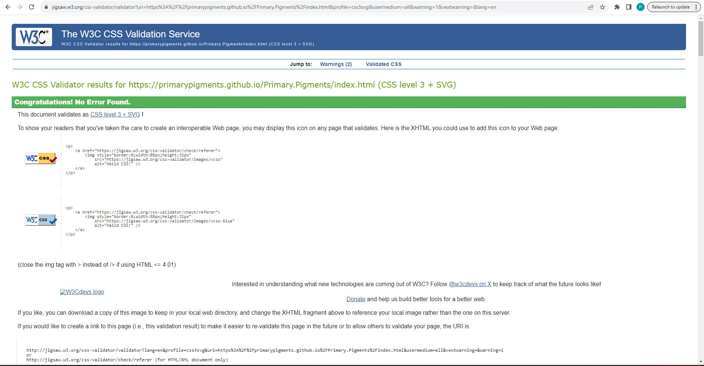 | No Error Found. | |Known Warning  ::-webkit-scrollbar is a vendor extended pseudo-element |
​
​
## Browser Compatibility
​
Recommended browsers to consider:
- [Chrome](https://www.google.com/chrome)
- [Edge](https://www.microsoft.com/edge)
- [Safari](https://support.apple.com/downloads/safari)
- [Opera](https://www.opera.com/download)
​
- I've tested my deployed project on multiple browsers to check for compatibility issues.
​
| Browser | Home | Gallery | Contact | Confirmation | Notes |
| --- | --- | --- | --- | --- | --- |

| Chrome | 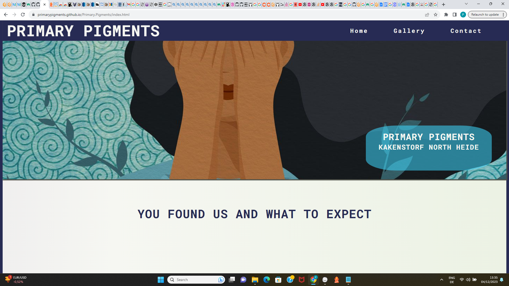 | 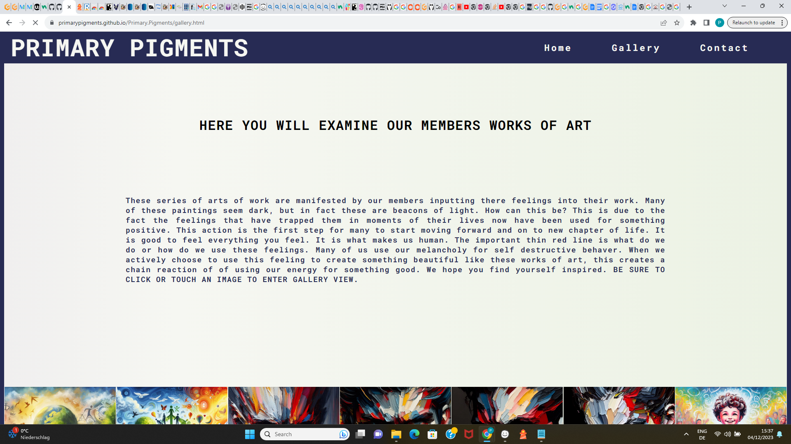 |  | 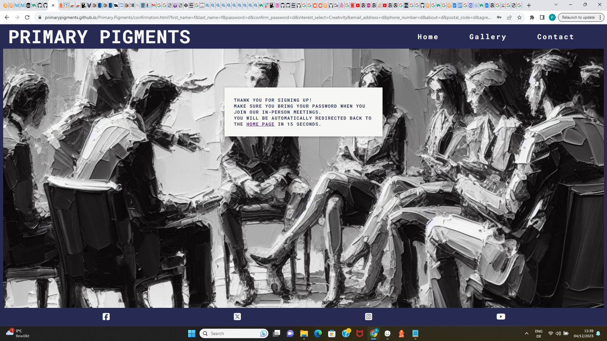 | Works as expected |

| Edge | 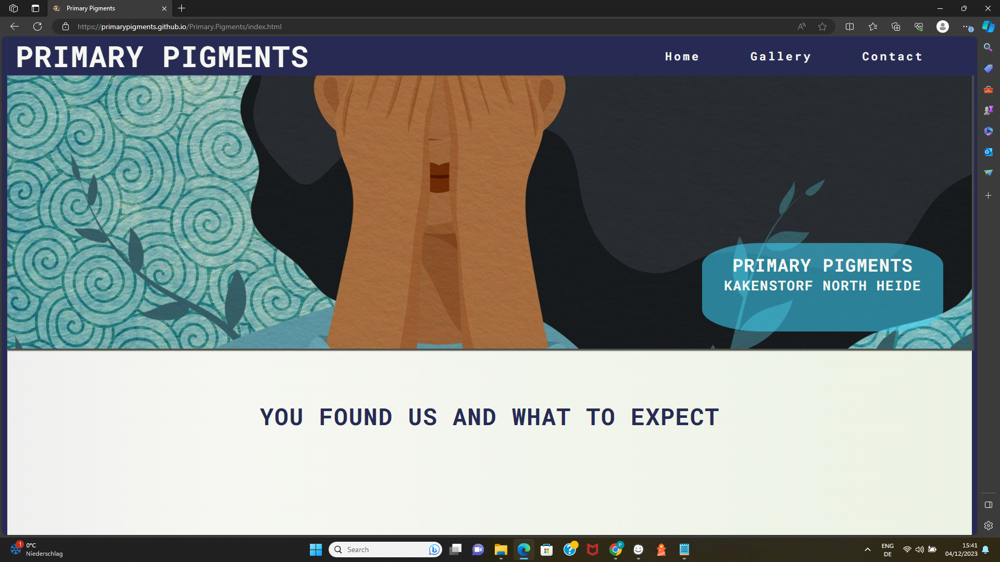 | 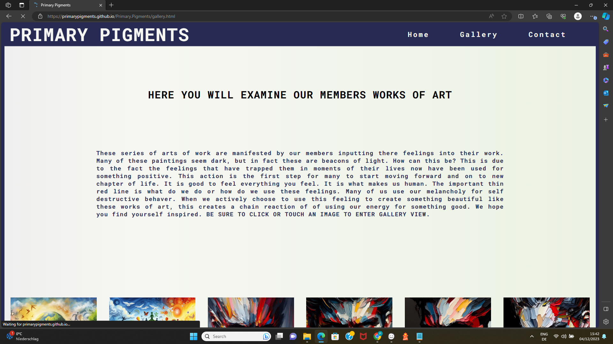 |  | 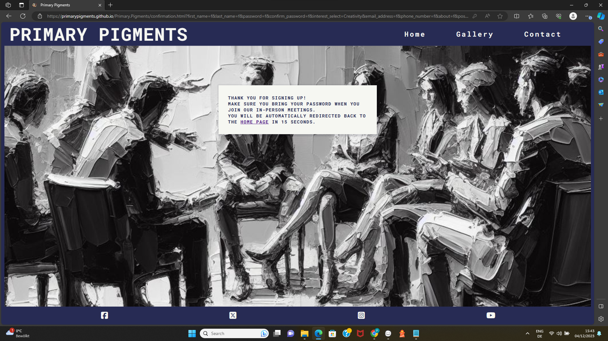 | Works as expected |

| Safari |  |  |  |  | Minor CSS differences |

| Opera |  |  |  |  | Minor differences |
​
## Responsiveness
​
I've tested my deployed project on multiple devices to check for responsiveness issues.
​
| Device | Home | Gallery | Contact | Confirmation | Notes |
| --- | --- | --- | --- | --- | --- |
| Mobile (DevTools) |  |  |  |  | Works as expected |
| Tablet (DevTools) |  |  | 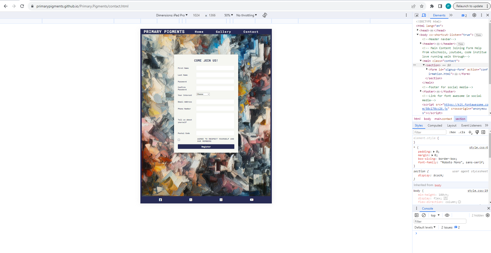 |  | Works as expected |
| Desktop |  | 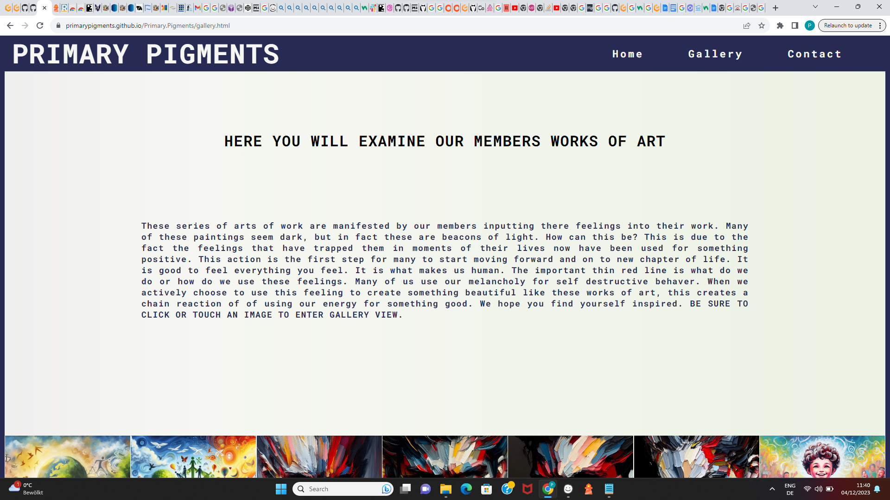 |  |  | Works as expected |
| Ipad Pro |  |  |  |  | Works as expected |
​
## Lighthouse Audit
​
I've tested my deployed project using the Lighthouse Audit tool to check for any major issues.
​
| Page | Mobile | Desktop | Notes |
| --- | --- | --- | --- |
| Home |  |  | Some minor warnings |
| Gallery | 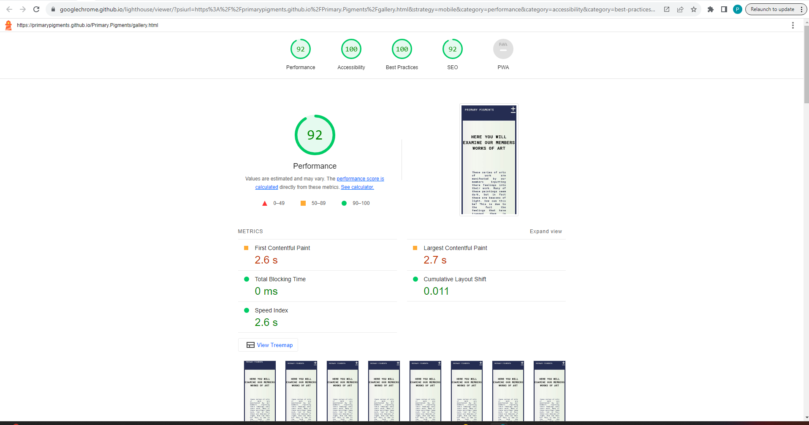 | 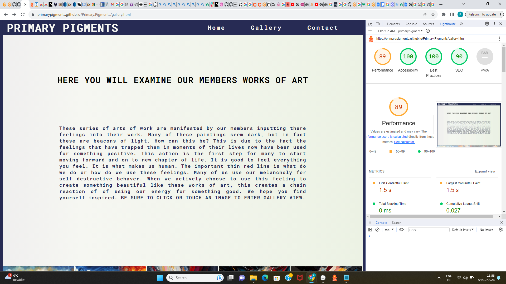 | Some minor warnings |
| Contact |  |  | Slow response time due to large images |
| Confirmation | 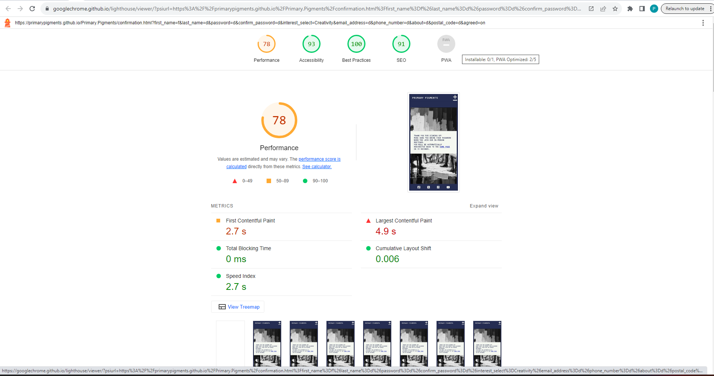 |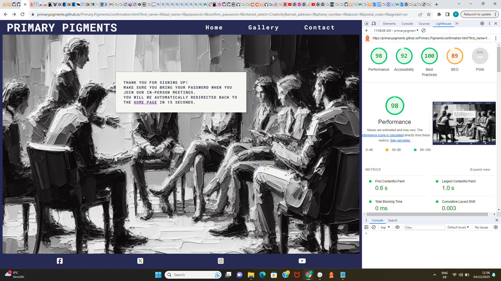 | Some minor warnings |  
​
## User Story Testing
​

| User Story | Screenshot |
| --- | --- |
| As a new site user, I would like to nurture my creativity, so that I can better express myself. | 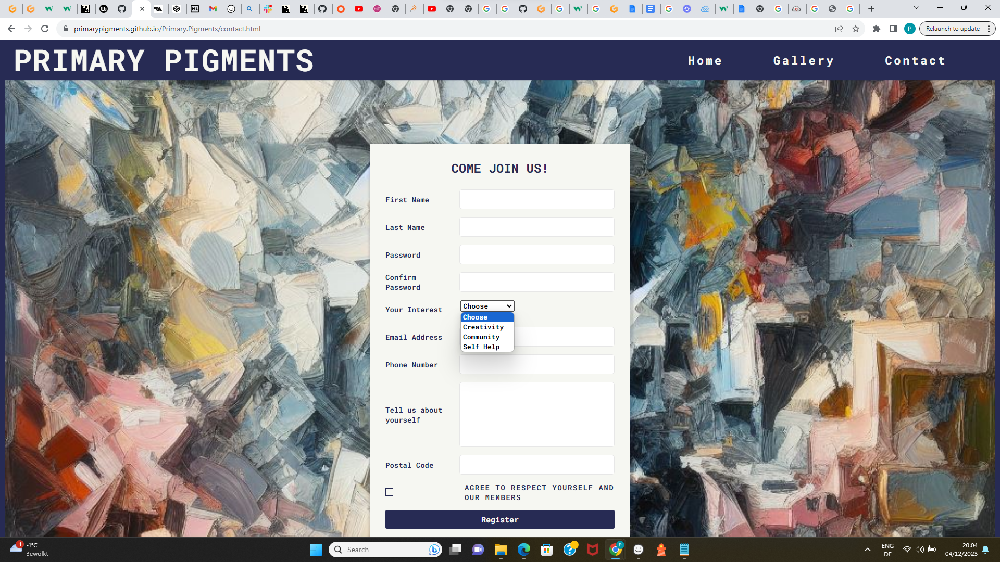 |
|As a new site user, I would like to help people because I am a psychologist , so that I can find new ways of treating my patience. |  |
| As a new site user, I would like to try a new approach to working through my trauma, so that I can appreciate the present moment.|  |
| As a returning site user, I would like to share this community with my friends, so that I can have friends who can join me. |  |
| As a returning site user, I would like to look at the paintings I made, so that I can share the paintings on my social media. | 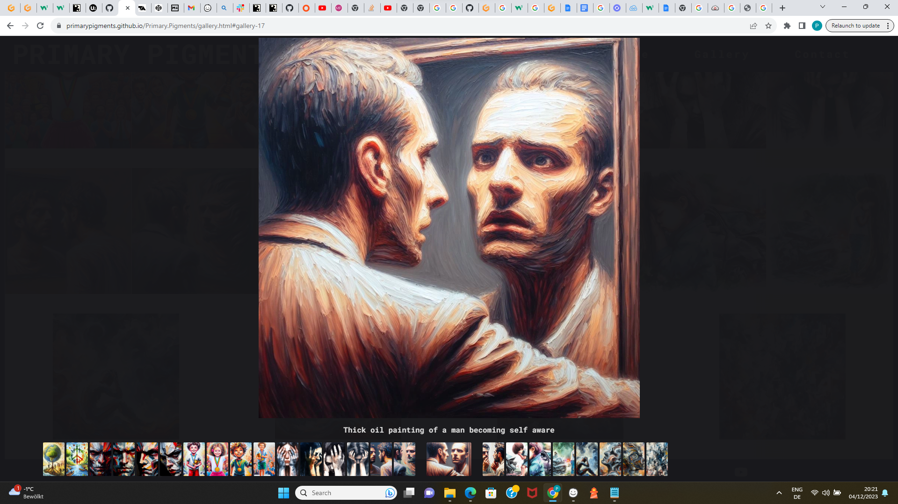 |
| As a returning site user, I would like to look at the beautiful paintings again , so that I can build the courage to join. |  |
|As a site administrator, I should be able to use the navbar, so that I can navigate through the other pages on the website. |  |
| As a site administrator, I should be able to click on an image on the gallery page, so that I can see the images in an enlarged view. |  |
| As a site administrator, I should be able to be directed to our social media pages, so that I can ensure our community grows. |  |

## Bugs
​
## Unfixed Bugs
​
- For PP3, when using a helper `clear()` function, any text above the height of the terminal does not clear, and remains when you scroll up.
​
    
​
    - Attempted fix: I tried to adjust the terminal size, but it only resizes the actual terminal, not the allowable area for text.
​
​
- When validating HTML with a semantic `section` element, the validator warns about lacking a header `h2-h6`. This is acceptable.
​
    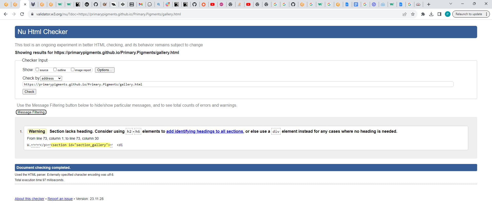
​
    - Attempted fix: this is a known warning and acceptable, and my section doesn't require a header since it's dynamically added via JS.
​
    - When validating HTML with a semantic `H1` element, the validator warns to Consider using the h1 element as a top-level heading only`. This is acceptable.
​
    
​
    - Attempted fix:  this is a known warning and acceptable, and my section doesn't require a changing the H1 header due to the size of the heading is appropriate for the intended use.
 
 - When validating HTML with a semantic `section` element, the validator warns about lacking a header `h2-h6`. This is acceptable.
​
    
​
    - Attempted fix: this is a known warning and acceptable, and my section doesn't require a header since it's a contact form.
-
[def]: https://cssgradient.io/

