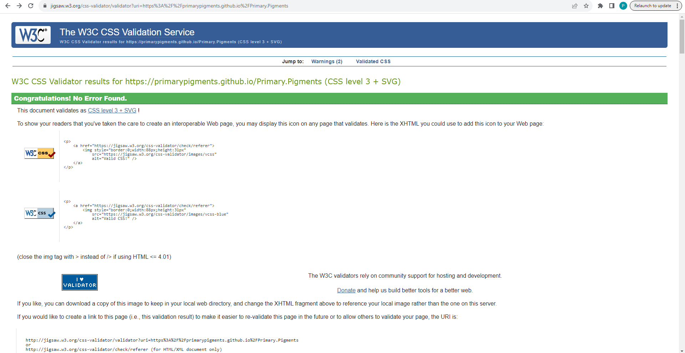
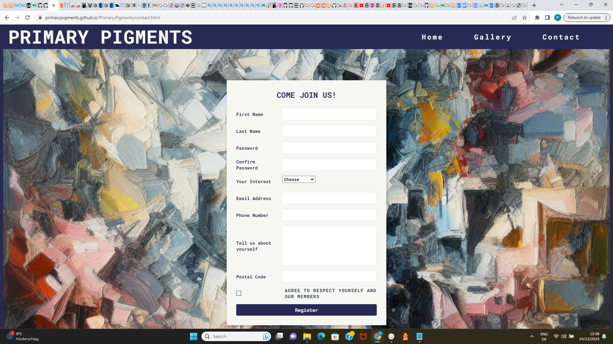
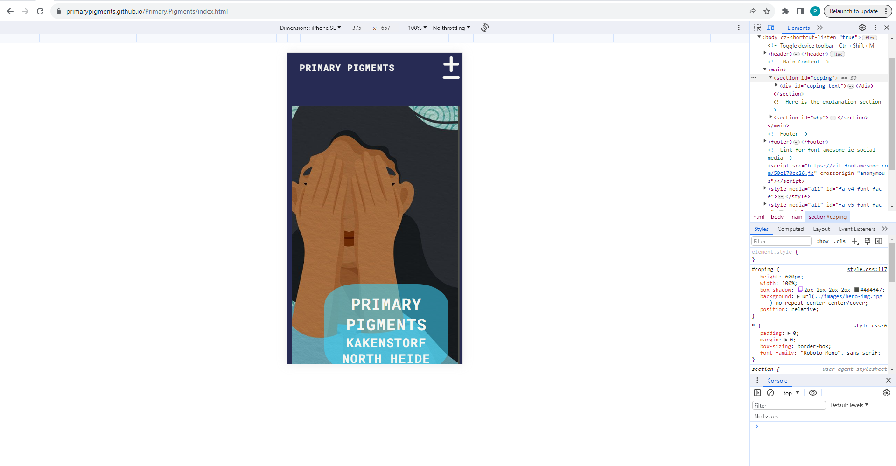
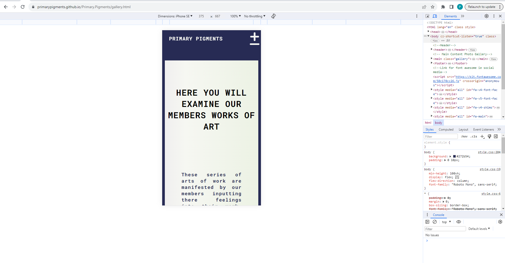
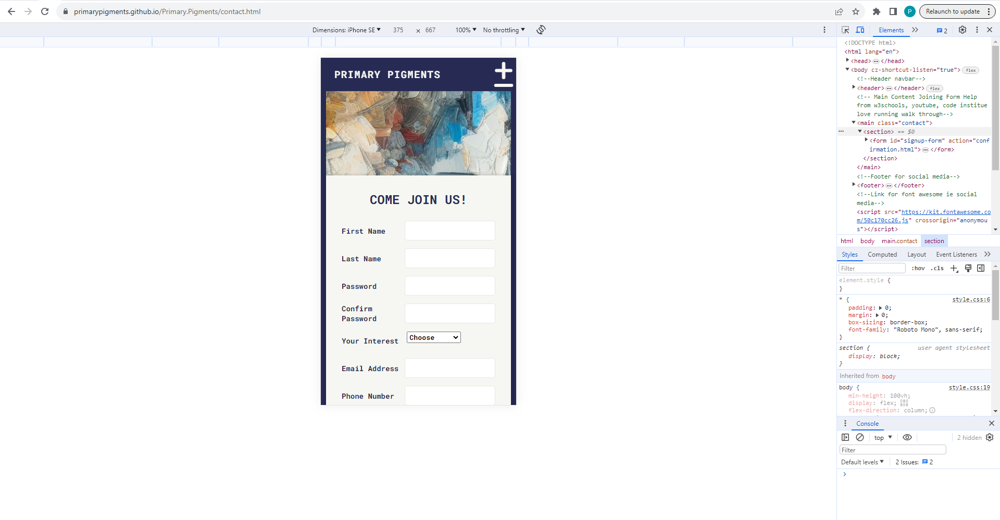
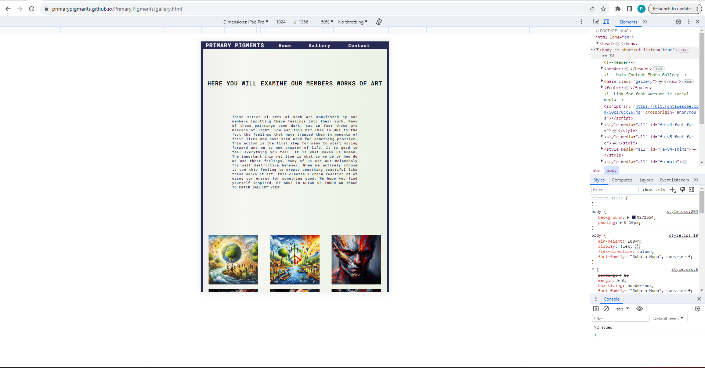
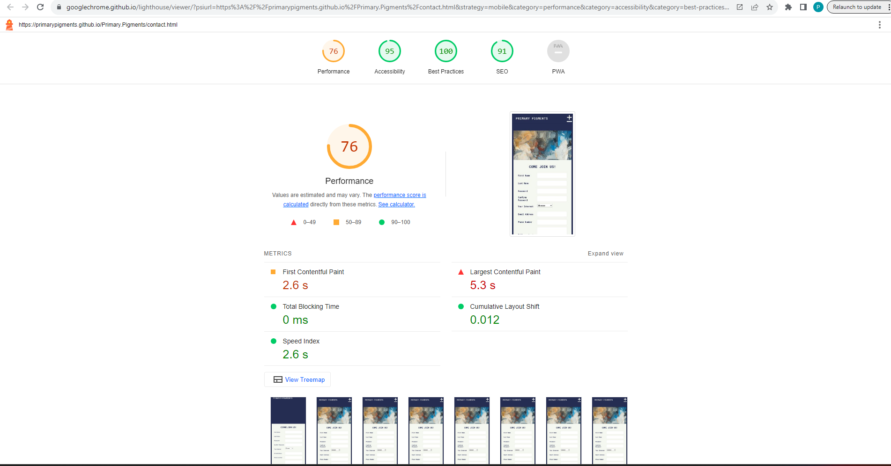
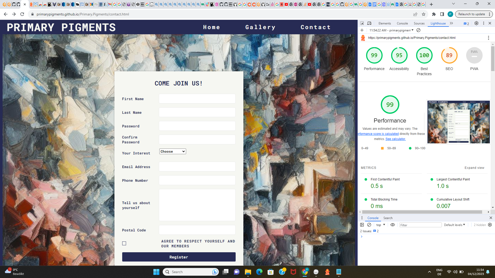
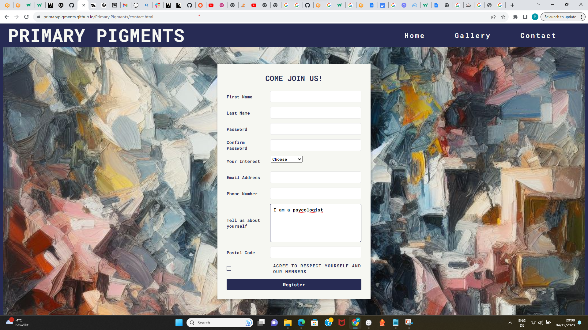

# Testing

Return back to the [README.md](README.md) file.

The Primary Pigments website has met the objectives set by all parties involved. It's responsive on various screen sizes, ensuring clean and crisp images without excessive empty space. Users can easily navigate and contact us through the contact form or social media. The content is concise, and the design is uncluttered, providing a user-friendly experience.

## Code Validation

### HTML

I have used the recommended [HTML W3C Validator](https://validator.w3.org) to validate all of my HTML files.

The URL will look something like this:

- https://validator.w3.org/nu/?doc=https%3A%2F%2Fprimarypigments.github.io%2Fprimary.pigments%2Findex.html

| Page | W3C URL | Screenshot | Notes |
| --- | --- | --- | --- |
| Home | [W3C](https://validator.w3.org/nu/?doc=https%3A%2F%2Fprimarypigments.github.io%2Fprimary.pigments%2Findex.html) |  | Consider using the h1 element as a top-level heading only warning |

| Gallery | [W3C](https://validator.w3.org/nu/?doc=https%3A%2F%2Fprimarypigments.github.io%2FPrimary.Pigments%2Findex.html) |  | obsolete iframe warnings |

| Contact | [W3C](https://validator.w3.org/nu/?doc=https%3A%2F%2Fprimarypigments.github.io%2FPrimary.Pigments%2Fgallery.html) |  | Section lacks heading warning |

| Confirmation | [W3C](https://validator.w3.org/nu/?doc=https%3A%2F%2Fprimarypigments.github.io%2FPrimary.Pigments%2Fconfirmation.html%3Ffirst_name%3Db%26last_name%3Db%26password%3Db%26confirm_password%3Db%26interest_select%3DCreativity%26email_address%3Db%26phone_number%3Db%26about%3Db%26postal_code%3Db%26agreed%3Don) |  | Section lacks heading warning |
|

### CSS

I have used the recommended [CSS Jigsaw Validator](https://jigsaw.w3.org/css-validator) to validate all of my CSS files.

| Home | [W3C](https://jigsaw.w3.org/css-validator/validator?uri=https%3A%2F%2Fprimarypigments.github.io%2FPrimary.Pigments%2Findex.html&profile=css3svg&usermedium=all&warning=1&vextwarning=&lang=en) |  |No Error Found. |

| Gallery | [W3C](https://jigsaw.w3.org/css-validator/validator?uri=https%3A%2F%2Fprimarypigments.github.io%2FPrimary.Pigments%2Fgallery.html&profile=css3svg&usermedium=all&warning=1&vextwarning=&lang=en) |  |No Error Found.|

| Contact | [W3C](https://jigsaw.w3.org/css-validator/validator?uri=https%3A%2F%2Fprimarypigments.github.io%2FPrimary.Pigments%2Fcontact.html&profile=css3svg&usermedium=all&warning=1&vextwarning=&lang=en) |  | No Error Found. |

| Confirmation | [W3C](https://jigsaw.w3.org/css-validator/validator?uri=https%3A%2F%2Fprimarypigments.github.io%2FPrimary.Pigments%2Fconfirmation.html%3Ffirst_name%3Ds%26last_name%3Ds%26password%3Ds%26confirm_password%3Ds%26interest_select%3DSelf%2BHelp%26email_address%3Ds%26phone_number%3Ds%26about%3Ds%26postal_code%3Ds%26agreed%3Don&profile=css3svg&usermedium=all&warning=1&vextwarning=&lang=en) |  | No Error Found. |
|

| File | Jigsaw URL | Screenshot | Notes |
| --- | --- | --- | --- |
| style.css | [Jigsaw](https://jigsaw.w3.org/css-validator/validator?uri=https%3A%2F%2Fprimarypigments.github.io%2Fprimary.pigments) |  | Pass: No Errors |

## Browser Compatibility

Recommended browsers to consider:
- [Chrome](https://www.google.com/chrome)
- [Edge](https://www.microsoft.com/edge)
- [Safari](https://support.apple.com/downloads/safari)
- [Opera](https://www.opera.com/download)

Sample browser testing documentation:

I've tested my deployed project on multiple browsers to check for compatibility issues.

| Browser | Home | About | Contact | etc | Notes |
| --- | --- | --- | --- | --- | --- |
|  |  |  |  |  | Works as expected |
|  |  |  |  |  | Works as expected |
|  |  |  |  |  | Works as expected |
|  |  |  |  |  | Minor CSS differences |
|  |  |  |  |  | Minor differences |

## Responsiveness

I've tested my deployed project on multiple devices to check for responsiveness issues.

| Device | Home | About | Contact | etc | Notes |
| --- | --- | --- | --- | --- | --- |
| Mobile (DevTools) |  |  |  |  | Works as expected |
| Tablet (DevTools) |  |  |  |  | Works as expected |
| Desktop |  |  |  | Works as expected |

| Ipad Pro |  |  |  |  | Works as expected |

## Lighthouse Audit

I've tested my deployed project using the Lighthouse Audit tool to check for any major issues.

| Page | Mobile | Desktop | Notes |
| --- | --- | --- | --- |
| Home |  |  | Some minor warnings |
| Gallery |  |  | Some minor warnings |
| Contact |  |  | Slow response time due to large images |
| COnfirmation |  |  | COnfirmation |  |

## User Story Testing

⚠️⚠️⚠️⚠️⚠️ START OF NOTES (to be deleted) ⚠️⚠️⚠️⚠️⚠️

Testing user stories is actually quite simple, once you've already got the stories defined on your README.

Most of your project's **features** should already align with the **user stories**,
so this should as simple as creating a table with the user story, matching with the re-used screenshot
from the respective feature.

🛑🛑🛑🛑🛑 END OF NOTES (to be deleted) 🛑🛑🛑🛑🛑

| User Story | Screenshot |
| --- | --- |
| As a new site user, I would like to nurtrue my creativity, so that I can better express myself. |  |
|As a new site user, I would like to help people because I am a psycologist , so that I can find new ways of treating my patince. |  |
| As a new site user, I would like to try a new approch to working through my trauma, so that I can appricate the present moment.|  |
| As a returning site user, I would like to share this community to my friends, so that I can have friends who can join me. |  |
| As a returning site user, I would like to look at the painting I made, so that I can so share the paintings to my social media. |  |
| As a returning site user, I would like to look at the beautiful paintings again , so that I can build the curage to join. |  |
| As a site administrator, I should be able to ____________, so that I can ____________. |  |
| As a site administrator, I should be able to ____________, so that I can ____________. |  |
| As a site administrator, I should be able to ____________, so that I can ____________. |  |
| repeat for all remaining user stories | x |

## Bugs

⚠️⚠️⚠️⚠️⚠️ START OF NOTES (to be deleted) ⚠️⚠️⚠️⚠️⚠️

This section is primarily used for JavaScript and Python applications,
but feel free to use this section to document any HTML/CSS bugs you might run into.

It's very important to document any bugs you've discovered while developing the project.
Make sure to include any necessary steps you've implemented to fix the bug(s) as well.

**PRO TIP**: screenshots of bugs are extremely helpful, and go a long way!

🛑🛑🛑🛑🛑 END OF NOTES (to be deleted) 🛑🛑🛑🛑🛑

- JS Uncaught ReferenceError: `foobar` is undefined/not defined

    

    - To fix this, I _____________________.

- JS `'let'` or `'const'` or `'template literal syntax'` or `'arrow function syntax (=>)'` is available in ES6 (use `'esversion: 11'`) or Mozilla JS extensions (use moz).

    

    - To fix this, I _____________________.

- Python `'ModuleNotFoundError'` when trying to import module from imported package

    

    - To fix this, I _____________________.

- Django `TemplateDoesNotExist` at /appname/path appname/template_name.html

    

    - To fix this, I _____________________.

- Python `E501 line too long` (93 > 79 characters)

    

    - To fix this, I _____________________.

## Unfixed Bugs

⚠️⚠️⚠️⚠️⚠️ START OF NOTES (to be deleted) ⚠️⚠️⚠️⚠️⚠️

You will need to mention unfixed bugs and why they were not fixed.
This section should include shortcomings of the frameworks or technologies used.
Although time can be a big variable to consider, paucity of time and difficulty understanding
implementation is not a valid reason to leave bugs unfixed.

If you've identified any unfixed bugs, no matter how small, be sure to list them here.
It's better to be honest and list them, because if it's not documented and an assessor finds the issue,
they need to know whether or not you're aware of them as well, and why you've not corrected/fixed them.

Some examples:

🛑🛑🛑🛑🛑 END OF NOTES (to be deleted) 🛑🛑🛑🛑🛑

- 

- For PP3, when using a helper `clear()` function, any text above the height of the terminal does not clear, and remains when you scroll up.

    

    - Attempted fix: I tried to adjust the terminal size, but it only resizes the actual terminal, not the allowable area for text.

- When validating HTML with a semantic `section` element, the validator warns about lacking a header `h2-h6`. This is acceptable.

    

    - Attempted fix: this is a known warning and acceptable, and my section doesn't require a header since it's dynamically added via JS.

    - When validating HTML with a semantic `H1` element, the validator warns to Consider using the h1 element as a top-level heading only`. This is acceptable.

    

    - Attempted fix:  this is a known warning and acceptable, and my section doesn't require a changing the H1 header due to the size of the heading is appropriate for the intended use.
 
 - When validating HTML with a semantic `section` element, the validator warns about lacking a header `h2-h6`. This is acceptable.

    

    - Attempted fix: this is a known warning and acceptable, and my section doesn't require a header since it's a contact form.
-
⚠️⚠️⚠️⚠️⚠️ START OF NOTES (to be deleted) ⚠️⚠️⚠️⚠️⚠️

If you legitimately cannot find any unfixed bugs or warnings, then use the following sentence:

🛑🛑🛑🛑🛑 END OF NOTES (to be deleted) 🛑🛑🛑🛑🛑

There are no remaining bugs that I am aware of.
 

[def]: https://cssgradient.io/